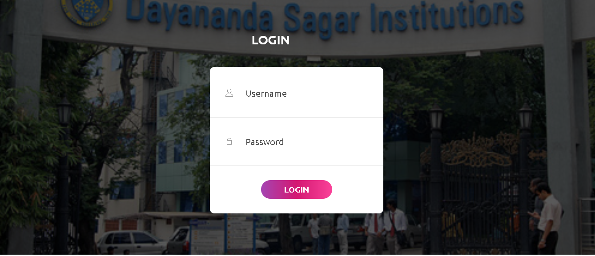
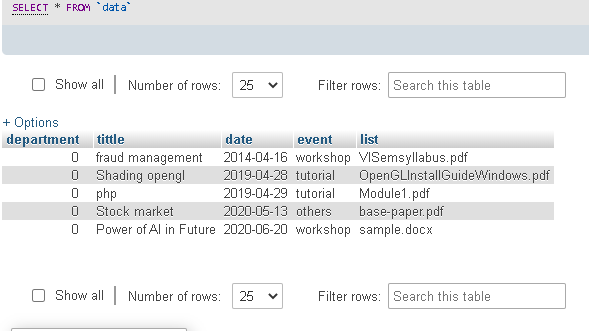
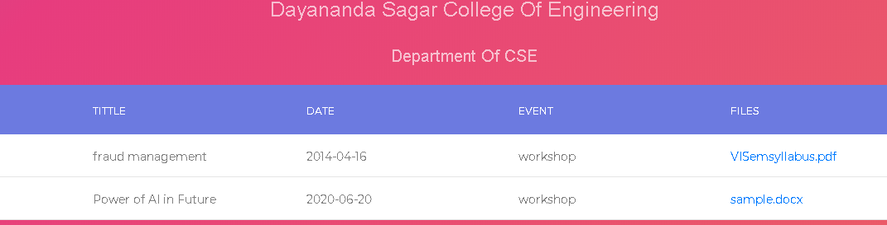

# **Centralized-Event-Repository**
This is a Web based event repository system to prevent paperwork involved in storage of information of events organized in college across many departments. Some of the key features in this project are- 

- Separate login for Principal, HOD’s of different departments and Faculties
- Dynamic uploading of data on server (File size and type restrictions)
- Filters to filter out data from database based off- Date, Event type, Event title
- Report download facilities provided

### **There are 3 levels of access involved-** 
1. Admin/Principal access
2. HOD access
3. Faculty access

### **Key features of each level of access :**

- Admin or principal can create Head of departments of different departments. He can filter out records uploaded by faculties of any department. He can print the reports for any event.

- HOD can create faculties in case a new faculty joins the department.He can filter out and print records uploaded by faculties belonging to their own department

- Faculties who beong to a department can enter information about an event they are going to organize in the department. This information is viewable to HOD of their department and Admin. Faculties need to enter **title of the event**, **type of event** (Hackathons/Seminars/Workshop/Tutorial/Newsletter/Mini Project/Others),**Date of Event**, **Report containing event information** (Report can be used for approval/updation or any further communication between HOD and faculty)

### **File structure is as follows:**
- database.sql - This contains the database structure and table creation/insertion commands performed initially
- logout.php - code to initialize and destroy a session
- config.php - code to provide **Username, Hostname, Password, Database name** for connection
- process.php - To check whether login credentials provided by users are valid or not(Authenticated from database). Based upon priority or level of access, appropriate php files are further called
- admin.php - code to display the screen for admin
- hod.php - code to display the screen for HOD
- faculty.php - code to display the screen for faculties
- fitler.php- code to create filter based off date. This code is called by admin as well as hod
- fitler2.php- code to create filter based off event type. This code is called by admin as well as hod
- fitler3.php- code to create filter based off event keyword. This code is called by admin as well as hod
- add.php - code to add users. This code is called by admin as well as hod. 
- p1.php - code to push files and details entered by faculty onto the database.

### **Tools and Language Used**
- HTML, CSS, Javascript, PHP
- JQuery
- XAMPP server (Apache, MYSql)

###**Running the Project:**
- Click on the clone/download button and download it as zip.
- Extract the zip by right clicking and extract it to your preferred location. Place all the files in a folder
- Copy the whole folder to XAMPP->htdocs. Now files in this folder can run from your localhost
- Run XAMPP server- MYSQL and Apache server
- Open PHPmyadmin server and create 3 tables based off the structure given below:

 
 
 

- Once the database is created, add few entries for each of the table in PHPmyadmin
- Now open localhost of Apache server and run the folder that you pasted in htdocs

### **Results/Working**

